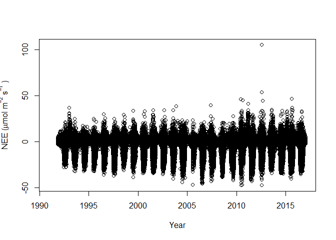
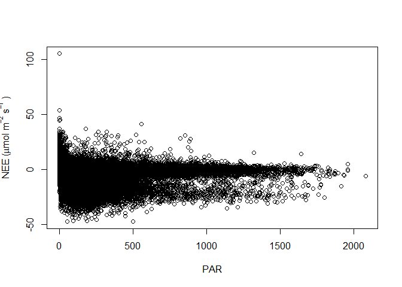
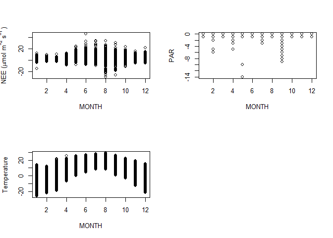
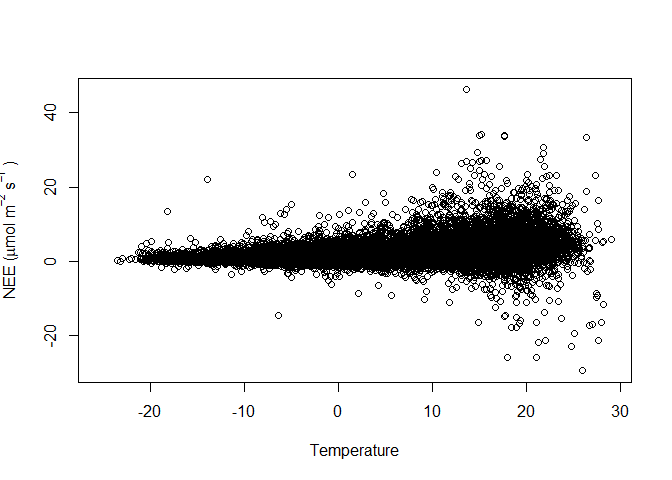

Workshop 2: Nonlinear Models
================
Meredith Emery
1/17/2020

# Objectives

The primary objectives of this analysis is to fit monthly light response
curves for Harvard forest to understand annual patterns ecosystem
photosynthetic potential and respiration rates in temperate mixed
forests..

# Methods

## Site Information

### Harvard Forest

The Harvard Forest has been part of the Long-Term Ecological Research
(LTER) since 1988. There are several towers that collect different
aspects of the forest, including; light, temperature and CO2. The data
for this project is from the Environmental Measurement Station Eddy Flux
Tower (EMS), shown as a yellow dot located on the right side of the
picture near the border and the NEON Tower, which is shown as a red dot.
Two variables that we will use from the EMS tower is the irradiance
(light) and temperature of the forest.

**Location:** Massachusetts, USA

**Climate:** Cool, moist temperate July mean temperature 20°C January
mean temperature -7°C; Annual mean precipitation 110 cm, distributed
fairly evenly throughout the year.

**Vegetation:** Transition Hardwood - White Pine - Hemlock Region
Dominant species: Red oak (*Quercus rubra*) Red maple (*Acer rubrum*)
Black birch (*Betula lenta*) White pine (*Pinus strobus*) Eastern
hemlock (*Tsuga canadensis*)

Figure 1. Hardvard Forest Map of the tower location.
(<https://harvardforest.fas.harvard.edu/>)

## Photosynthetic Potential

The maximum amount of carbon dioxide that the forest can fix depends on
the amount of light the forest experiences. The photosynthetically
active radiation (PAR) is the radiation range between 400-700nm wave
band. Thus, the photosynthetic potential is the most carbon fixed when
experience a certain amount of radiation, also called the Pmax. The
amount of photosynthesis with respect to a given irradiance does not
follow a linear equation, instead it follows the Michaelis-Menten
Approach equation.

Figure 2. Photosynthesis-irradiation curve. Shows the maximum
photosynthetic potential (\(P_{max}\)).
(<https://en.wikipedia.org/wiki/PI_curve>).

## Ecosystem Respiration

The amount of carbon dioxide that is release back into the atmosphere
from autotrophic and heterotrophic production is called ecosystem
respiration. Plants respire carbon dioxide at night, which the amount of
carbon dioxide is temperature dependent. Therefore, the ecosystem
respiration follows the Arrhenius Approach equation.

Figure 3. Carbon movement between photosynthesis, carbon uptake, and
ecosystem respiration, carbon release. (www.nceas.ucsb.edu)

# Results

NEE per
Year

Light Response Curve Net Ecosystem Exchange (NEE) with respect to
photosynthetically active radiation (PAR)

NEE, PAR and Temperature per
Month

Temperature Response Curve NEE
vs. Temperature

| MONTH |     a |       b | a.pvalue | b.pvalue | a.est |  b.est |  a.se |  b.se |
| ----: | ----: | ------: | :------- | :------- | ----: | -----: | ----: | ----: |
|     1 | 1.282 |   0.028 | p\<0.001 | p\<0.001 | 1.280 |   0.03 | 0.044 | 0.005 |
|     2 | 1.236 |   0.031 | p\<0.001 | p\<0.001 | 1.235 |   0.03 | 0.033 | 0.005 |
|     3 | 1.101 |   0.038 | p\<0.001 | p\<0.001 | 1.098 |   0.04 | 0.026 | 0.004 |
|     4 | 1.270 |   0.048 | p\<0.001 | p\<0.001 | 1.275 |   0.05 | 0.057 | 0.005 |
|     5 | 1.756 |   0.057 | p\<0.001 | p\<0.001 | 1.772 |   0.06 | 0.110 | 0.004 |
|     6 | 2.400 |   0.039 | p\<0.001 | p\<0.001 | 2.402 |   0.04 | 0.315 | 0.008 |
|     7 | 2.005 |   0.045 | p\<0.001 | p\<0.001 | 2.059 |   0.04 | 0.327 | 0.008 |
|     8 | 4.799 | \-0.014 | p\<0.001 | 0.11     | 4.916 | \-0.01 | 0.956 | 0.011 |
|     9 | 1.821 |   0.037 | p\<0.001 | p\<0.001 | 1.823 |   0.04 | 0.193 | 0.006 |
|    10 | 1.680 |   0.039 | p\<0.001 | p\<0.001 | 1.684 |   0.04 | 0.091 | 0.005 |
|    11 | 1.674 |   0.053 | p\<0.001 | p\<0.001 | 1.670 |   0.05 | 0.042 | 0.004 |
|    12 | 1.641 |   0.035 | p\<0.001 | p\<0.001 | 1.637 |   0.03 | 0.037 | 0.005 |

Table 1. Temperature Response Curve. The variables; Base respirations
rate (a) is when temperature is zero, empirical coefficent (b), a.est
and b.est is the values given from bootstrap and the standard error of a
and b (a.se and b.se)

# Discussion

The Net Ecosystem Exchange (NEE) during the day and night does not
follow a linear equation. In order to fit the NEE during the day as a
function of photosynthesis active radiation (PAR), we used the
Michaelis-Menton Approach for the light response curve model. However,
because the PAR changes depending on the time of year, the best fit
model resulted after sub-setting for each month and fitting the light
response curve for each month. In addition, the NEE during the night, or
the respiration rate, as a function of temperature used the Arrhenius
Approach. Like PAR, temperature changes depending on the time of year,
and resulting in the best model was after sub-setting for each month
(shown in table 1). The reason sub-setting for each month gave the best
model for both light and temperature response curve model, is because
the deciduous forest changes based on season. For example, the Harvard
Forest will have more leaves during the summer months and thus NEE will
have a greater change between uptake of carbon dioxide and release
compare to during the winter, which would have less of change of NEE,
since there is limited leaves, resulting in less uptake of carbon
dioxide from photosynthesis. Therefore, predicting future trends should
be shown per month.
